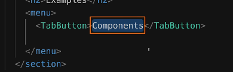
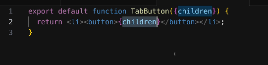
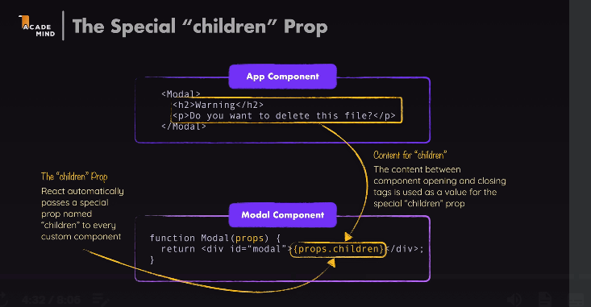
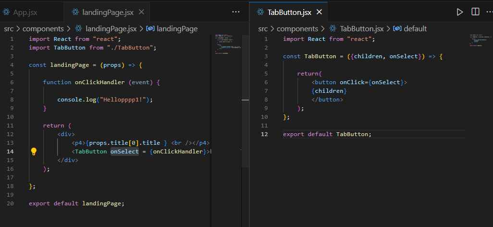

# react-learning

Library: Prime React and ag-grid

React Learning

This image tells how we can use spread operator '...' instead of different props names.


Instead of using props we can directly destructure the props using ' {} ' curly braces: And can use direct names


# More Prop Syntaxes

Beyond the various ways of setting and extracting props about which you learned in the previous lecture, there are even more ways of dealing with props.

But no worries, you'll see all these different features & syntaxes in action throughout the course!

Passing a Single Prop Object

If you got data that's already organized as a JavaScript object, you can pass that object as a single prop value instead of splitting it across multiple props.

I.e., instead of

```react.js
<CoreConcept
  title={CORE_CONCEPTS[0].title}
  description={CORE_CONCEPTS[0].description}  
  image={CORE_CONCEPTS[0].image} />
```
or
```react.js
<CoreConcept
  {...CORE_CONCEPTS[0]} />
  ```
you could also pass a single concept (or any name of your choice) prop to the CoreConcept component:

<CoreConcept
  concept={CORE_CONCEPTS[0]} />
  
**In the CoreConcept component, you would then get that one single prop:**

```react.js
export default function CoreConcept({ concept }) {
  // Use concept.title, concept.description etc.
  // Or destructure the concept object: const { title, description, image } = concept;
}
```
It is entirely up to you which syntax & approach you prefer.

Grouping Received Props Into a Single Object

You can also pass multiple props to a component and then, in the component function, group them into a single object via JavaScript's "Rest Property" syntax.

I.e., if a component is used like this:

```react.js
<CoreConcept
  title={CORE_CONCEPTS[0].title}
  description={CORE_CONCEPTS[0].description}  
  image={CORE_CONCEPTS[0].image} />
  ```

You could group the received props into a single object like this:

```react.js
export default function CoreConcept({ ...concept }) { 
  // ...concept groups multiple values into a single object
  // Use concept.title, concept.description etc.
  // Or destructure the concept object: const { title, description, image } = concept;
}

```
If that syntax is a bit confusing - worry not! You'll also see concrete examples for this syntax (and for why you might want to use it in certain situations) throughout the course!

Default Prop Values

Sometimes, you'll build components that may receive an optional prop. For example, a custom Button component may receive a type prop.

So the Button component should be usable either with a type being set:
```react.js
<Button type="submit" caption="My Button" />
```
Or without it:
```react.js
<Button caption="My Button" />
```
To make this component work, you might want to set a default value for the type prop - in case it's not passed.

This can easily be achieved since JavaScript supports default values when using object destructuring:

```react.js
export default function Button({ caption, type = "submit" }) { 
  // caption has no default value, type has a default value of "submit"
}
```


# Children Props

**Children Props -> content between our component tags**



use '{}' destructuring instad of props in TabButton tag:







**This Image shows how we can pass down function from one component to another
Like here from landingPage to TabButton**




1. ...props is added to add remaning props passed for the component.
2. useRef: we can use it for accessing the value or properties of an eleent AND current property is always used to access further elements.
3. 
4. 


